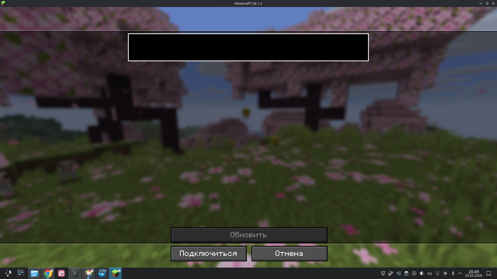

# TailMod — Tailscale for Minecraft

**Play with friends on your private Tailnet without port forwarding, without public servers.**

TailMod embeds a full Tailscale node (via [tsnet](https://pkg.go.dev/tailscale.com/tsnet)) directly into the Minecraft client. No external daemon, no router configuration — just click and connect.



---

## Features

- **One-click connect** — see all your Tailnet peers, click to join their Minecraft server
- **LAN world sharing** — friends who open "Open to LAN" appear in TailnetScreen automatically; connect with one click just like a real LAN game
- **Auto-reconnect** — on restart the mod silently reconnects using saved credentials (no re-login needed)
- **Browser auth** — no auth key required; log in via browser the first time, done
- **SLP ping** — shows server version and player count (`3/20 | 1.21.4 | 12ms`) for each online peer
- **Favorites** — star ★ any peer to pin them to the top
- **Online first** — online peers always sorted above offline ones
- **Double-click to connect** — works like the normal multiplayer screen
- **Voice chat proxy** — Simple Voice Chat (port 24454) and webcam mods (port 25454) work out of the box
- **Configurable UDP ports** — add any extra UDP ports in ModMenu settings
- **Cross-platform natives** — prebuilt `libtailscale` for Linux x64, macOS x64 and macOS arm64 (Apple Silicon)
- **ModMenu settings** — change auth key, UDP ports, disconnect, all without restarting

---

## Requirements

| Dependency | Version |
|---|---|
| Minecraft | 26.1.2 |
| Fabric Loader | 0.19.1 |
| Fabric API | 0.149.1+26.1.2 |
| [ModMenu](https://modrinth.com/mod/modmenu) | 18.0.0-alpha.8 (optional) |

---

## Installation

1. Install [Fabric Loader 0.19.1](https://fabricmc.net/) for Minecraft 26.1.2
2. Drop `tailmod-0.1.0.jar` into your `.minecraft/mods/` folder
3. Launch the game — the **Tailnet** button appears next to **Multiplayer** on the title screen

### First login

- **With auth key** — paste your `tskey-auth-...` key from [Tailscale Admin](https://login.tailscale.com/admin/authkeys)
- **Browser login** — click "Войти через браузер", approve in your browser, done

Credentials are saved; subsequent launches connect automatically.

---

## How it works

```
Minecraft client
  └─ TailMod (Fabric mod)
       ├─ tsnet node (libtailscale.so / .dylib)   ← userspace Tailscale, no daemon needed
       ├─ TCP proxy 127.0.0.1:25566               ← MC connects here, we forward via tsnet
       ├─ UDP proxies 24454, 25454, …             ← voice chat, webcam mods
       └─ LAN beacon :25561                       ← announces open LAN worlds to tailnet peers
```

The mod starts an embedded Tailscale node in the JVM process using [tsnet](https://github.com/tailscale/tailscale). All traffic between you and your peers goes directly over WireGuard — no Mojang relay, no third-party proxy.

---

## Building from source

Requires: Go 1.22+, JDK 25, Zig (for macOS cross-compilation), nix-shell (optional).

```bash
# Build native libraries for all platforms
nix-shell shell.nix --run "bash scripts/build-native.sh all"

# Build the mod jar
nix-shell shell.nix --run "gradle build"

# Output: build/libs/tailmod-0.1.0.jar
```

For a single platform (e.g. Linux):
```bash
nix-shell shell.nix --run "bash scripts/build-native.sh linux-amd64"
```

---

## Architecture

| Component | Description |
|---|---|
| `native/tailscale.go` | CGo wrapper over tsnet; exports C API loaded via JNA |
| `tailscale/TailscaleNode.java` | High-level Java wrapper around the native node |
| `proxy/TailProxy.java` | TCP proxy: `127.0.0.1:25566` → `peer_ip:mcPort` via tsnet |
| `proxy/UdpPortProxy.java` | UDP proxy for voice/webcam ports |
| `LanDiscovery.java` | LAN world beacon — detect and share open LAN worlds over Tailnet |
| `SlpPinger.java` | Modern SLP ping (1.7+ protocol) through tsnet |
| `screen/TailnetScreen.java` | Peer list UI with SLP status, LAN worlds, favorites |
| `mixin/TitleScreenMixin.java` | Splits "Multiplayer" button → "Multiplayer" + "Tailnet" |
| `mixin/ConnectScreenMixin.java` | Auto-routes Tailscale IPs (100.64–127.x) through the proxy |
| `mixin/LanServerPingerMixin.java` | Captures "Open to LAN" events to broadcast to peers |

---

## License

MIT
